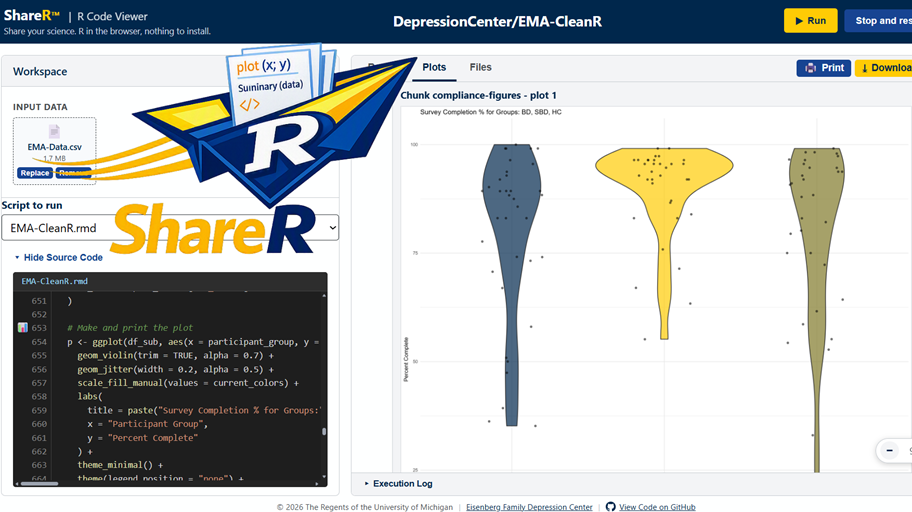

<!--
This file is part of ShareR™
README.md
Author(s): Gabriel Mongefranco.
Created: 2026-07-27
Last Modified: 2026-07-27
Summary: ShareR™ runs R and R Markdown scripts entirely inside a web browser. This file provides an overview of the project, in Markdown format.
Notes: See README file for documentation and full license information.

Copyright © 2026 The Regents of the University of Michigan

This program is free software: you can redistribute it and/or modify
it under the terms of the GNU General Public License as published by
the Free Software Foundation, either version 3 of the License, or (at your option) any later version.
This program is distributed in the hope that it will be useful,
but WITHOUT ANY WARRANTY; without even the implied warranty of
MERCHANTABILITY or FITNESS FOR A PARTICULAR PURPOSE. See the
GNU General Public License for more details.
You should have received a copy of the GNU General Public License along
with this program. If not, see <https://www.gnu.org/licenses/>.

-->

# ShareR™
### _Share your science. R in the browser, nothing to install._

## Description
ShareR™ runs R and R Markdown scripts entirely inside a web browser. There is no server, no R installation, and no setup. Point it at a GitHub repository, add your own data files, and press Run.

ShareR™ lets you run an R analysis right in your web browser, no installation required. Share a link to your R script or R Markdown file on GitHub, and anyone can open it, add their own data, and run it instantly, even on a locked-down work laptop where they can't install software.

Everything happens on your computer. Your files are never uploaded anywhere, and there's no server behind ShareR that could receive them. When you run an analysis, you'll see the results build in real time: charts, tables, and any files the script creates, all wrapped up into a report you can view right away or download as a package to keep.

For research teams, that means anyone on the project can run the same analysis the same way, without needing R installed or any technical setup, just a link and a browser.

## Quick Start Guide
**Run someone else's analysis**

1. Open ShareR with the repository in the URL:
   <a href="https://code.depressioncenter.org/ShareR/?repo=DepressionCenter/EMA-CleanR" target="_blank" title="View live demo of ShareR">`https://code.depressioncenter.org/ShareR/?repo=DepressionCenter/EMA-CleanR`</a>
2. Wait for the one-time download of the R engine and packages. The script will run automatically using the sample data file(s) included in the repository.
3. You can also replace the data files with your own in the Workspace panel, then click the yellow Run button. ShareR will use your files instead of the sample data, and regenerate the report tab.
4. Read the report, then press **Download all outputs** to get a ZIP with the report, the generated files, the console log, and a run manifest.

**Run your own script without a repository**

1. Open <a href="https://code.depressioncenter.org/ShareR/" target="_blank" title="View live demo of ShareR">`https://code.depressioncenter.org/ShareR/`</a> with no parameters.
2. Drop in your `.R` or `.Rmd` file together with its data files, or drop a whole folder.
3. Press **Run analysis**.

**Run it locally**

1. Clone or download this repository.
2. Run `.\run-windows.ps1` (Windows), `./run-linux.sh` (Linux), or double-click `run-mac.command` (macOS). These wrap the bundled [ZippyServe](https://github.com/DepressionCenter/ZippyServe) binary, so nothing has to be installed.
3. Your browser opens to `http://localhost:8010`.

**Share your script with others**

1. Publish your repository on GitHub, then share the link to ShareR with the `?repo=Owner/RepoName` parameter. For example, `https://code.depressioncenter.org/ShareR/?repo=DepressionCenter/EMA-CleanR` runs the reference workflow in the `DepressionCenter/EMA-CleanR` repository.
2. If your repository contains multiple scripts, ShareR will list them and let the user choose which one to run. If you want to be explicit about which script is the entry point, add a `&script=` parameter to the URL, followed by the path to the script (relative to the repository root). Example: `https://code.depressioncenter.org/ShareR/?repo=DepressionCenter/EMA-CleanR&script=EMA-CleanR.rmd`.
3. If your script references sample data files, and you have those in your repo, it will run with the sample data. You can also specify which data files to use by adding a `&data=` parameter to the URL, followed by a comma-separated list of file names (relative to the repository root). Example: `https://code.depressioncenter.org/ShareR/?repo=DepressionCenter/EMA-CleanR&script=EMA-CleanR.rmd&data=EMA-Data.csv`.
4. Share the link with your colleagues, and they can run the analysis in their own browser, with their own data files, without installing anything!

## Documentation
+ The full documentation is available at: https://michmed.org/efdc-kb
+ Technical specification: [`docs/ShareR-Technical-Specification.md`](docs/ShareR-Technical-Specification.md)

### Setting Up and Using ShareR

#### Putting Up Your Own Copy

1. Fork or copy this repository.
2. In your repository's **Settings > Pages**, choose to publish from the `main` branch, root folder. Make sure **Enforce HTTPS** is turned on.
3. Add your organization's name to `CONFIG.TRUSTED_OWNERS` in `index.html`, so that repositories you publish don't show visitors an "unknown author" warning.
4. That's it. There's no build step, no software to install, nothing to compile. Whatever is in the repository is exactly what gets published.

### Requirements and Configuration

**For users:** a current version of Chrome, Edge, Firefox, or Safari with WebAssembly enabled. Roughly 300 MB of free browser storage for the cached R engine and packages. No account, no login, no API key.

**URL parameters**

| Parameter | Meaning | Default |
| --- | --- | --- |
| `repo` | `Owner/RepoName` of a public GitHub repository, or a full GitHub/GitLab/Bitbucket repository URL | none, which starts ShareR in upload mode |
| `ref` | Branch, tag, or commit SHA. `branch` is accepted as an alias. | the repository's default branch (main) |
| `entry` or `script` | Path to the script to run or the URL to the script (if not using a repository) | auto-detected (when using a repository) |

ShareR always runs the script automatically once it and its files are staged; use the **Run** button to run again manually.

**For repository authors:** nothing is required. Optionally, include sample data for your script in your repo (preferably in a `data/` folder). Any files referenced by your script and hosted in the same repository will be loaded automatically.

**For maintainers:** all configuration lives in a single frozen `CONFIG` object at the top of `index.html`, including the pinned webR version, the package repository URL, size limits, and the trusted-owner allowlist. There are no secrets, no environment variables, and no build step. Editing `WEBR_VERSION` is the only supported way to upgrade the R engine, and doing so automatically invalidates the old cache.

### Privacy, Security, and Accessibility

**Where your data goes:** nowhere but your own computer. Files you open in ShareR are only ever processed inside your browser. They are never uploaded, and there is no server on the other end that could receive them, even if it wanted to. ShareR is built so that it technically cannot send your files out, and it doesn't use analytics or tracking cookies either.

**What ShareR does reach out for:** when you point it at a GitHub repository, it does contact GitHub to fetch that repository's files, which means GitHub can see which project you're running, the same as it would if you visited that page in your browser. ShareR also downloads the R software itself the first time you use it. None of this ever includes your own data. If you'd rather ShareR make no outside requests at all, you can use it with files from your computer once the R software is already cached.

**On compliance:** Always check with your IRB and your organization's cybersecurity or information assurance team before using this application with PHI or confidential data.

**A note on running other people's code:** ShareR can open and run any public GitHub repository. The code always runs safely inside your browser and can't reach the rest of your computer, but it can read any file you personally add to the page.

**Accessibility:** ShareR is built to work well with screen readers, keyboard-only navigation, and other assistive technology, aiming to meet the WCAG 2.2 AA accessibility standard.

**A few things ShareR can't do yet:**

+ Only R packages that have a browser-compatible version available can be used. If a script needs one that isn't available, ShareR will display an error message, but will give you the option to try running the script anyway without the missing packages.
+ Your browser has a limited amount of memory, so very large datasets combined with many packages may not fit.
+ Private (non-public) GitHub repositories aren't supported directly. Use the drag-and-drop upload option instead. ShareR never asks for, and never stores, any GitHub login or access credentials.

## Additional Resources
+ [Eisenberg Family Depression Center](https://depressioncenter.org)
+ [EFDC open source projects](https://code.depressioncenter.org)
+ [EMA-CleanR](https://github.com/DepressionCenter/EMA-CleanR), the reference workflow
+ [ZippyServe](https://github.com/DepressionCenter/ZippyServe), the bundled local web server
+ [webR documentation](https://docs.r-wasm.org/webr/latest/)

## About the Team
The [Mobile Technologies Core](https://depressioncenter.org/mobiletech) provides investigators across the University of Michigan the support and guidance needed to utilize mobile technologies and digital mental health measures in their studies. Experienced faculty and staff offer hands-on consultative services to researchers throughout the University – regardless of specialty or research focus.

Learn more at: [https://depressioncenter.org/mobiletech](https://depressioncenter.org/mobiletech).

## Contact
To get in touch, contact the individual developers in the check-in history.

If you need assistance identifying a contact person, email the EFDC's Mobile Technologies Core at: efdc-mobiletech@umich.edu.

## Credits
#### Authors:
+ [Gabriel Mongefranco](https://gabriel.mongefranco.com) [(@gabrielmongefranco)](https://github.com/gabrielmongefranco)

#### Contributors:
+ [Eisenberg Family Depression Center](https://depressioncenter.org) [(@DepressionCenter)](https://github.com/DepressionCenter)

#### This work is based in part on the following projects, libraries and/or studies:
+ [webR](https://github.com/r-wasm/webr) - "The statistical language R compiled to WebAssembly via Emscripten, for use in web browsers and Node," by George Stagg and Lionel Henry. Runs the R and R Markdown scripts entirely inside the browser; it is ShareR's execution engine. License: GPL-3.
+ [DataLaVista™](https://github.com/DepressionCenter/DataLaVista) - A lightweight, client-side reporting and dashboard toolkit. This project re-uses some of the CORS proxy fallback functions and UI design ideas.
+ [fflate](https://github.com/101arrowz/fflate) - "High performance (de)compression in an 8kB package." Builds the downloadable ZIP archive of a run's output files, rendered report, execution log, manifest, and source script. License: MIT.
+ [js-yaml](https://github.com/nodeca/js-yaml) - "JavaScript YAML parser and dumper. Very fast." Parses an `.Rmd` file's YAML front matter (title, `params`, output options). License: MIT.
+ [marked](https://github.com/markedjs/marked) - "A markdown parser and compiler. Built for speed." Renders the Markdown prose in `.Rmd` chunks to HTML for the Report tab. License: MIT.
+ [DOMPurify](https://github.com/cure53/DOMPurify) - "A DOM-only, super-fast, uber-tolerant XSS sanitizer for HTML, MathML and SVG." Sanitizes that rendered HTML before it is ever inserted into the page - the app's one deliberate `innerHTML` assignment. License: Apache-2.0 or MPL-2.0 (dual-licensed).
+ [prism-code-editor](https://github.com/FIameCaster/prism-code-editor) - "Lightweight, extensible code editor component for the web using Prism." Powers the syntax-highlighted R/R Markdown script editor. License: MIT.
+ [docx](https://github.com/dolanmiu/docx) - "Easily generate and modify .docx files with JS/TS with a nice declarative API. Works for Node and on the Browser." Builds the downloadable Word export of a rendered report. License: MIT.
+ [PptxGenJS](https://github.com/gitbrent/PptxGenJS) - "Build PowerPoint presentations with JavaScript. Works with Node, React, web browsers, and more." Builds the downloadable PowerPoint export of a rendered report. License: MIT.
+ [ExcelJS](https://github.com/exceljs/exceljs) - "Excel Workbook Manager." Builds the downloadable Excel workbook export of a run's output tables. License: MIT.
+ [jsPDF](https://github.com/parallax/jsPDF) - "Client-side JavaScript PDF generation for everyone." Builds the downloadable PDF export of a rendered report. License: MIT.
+ [jsPDF-AutoTable](https://github.com/simonbengtsson/jsPDF-AutoTable) - "jsPDF plugin for generating PDF tables with javascript." Renders output tables inside the PDF exports jsPDF produces. License: MIT.
+ [Bootstrap Icons](https://github.com/twbs/icons) - "Official open source SVG icon library for Bootstrap with over 2,000 icons." Most icons in ShareR's interface are inline SVG path data copied from this library; there is no icon font or runtime request. License: MIT.
+ [fst](https://github.com/fstpackage/fst), [fstcore](https://github.com/fstpackage/fstcore), and [fstlib](https://github.com/fstpackage/fstlib) - "Lightning Fast Serialization of Data Frames for R" ([fst](https://github.com/fstpackage/fst)), its "R bindings to the fstlib library" ([fstcore](https://github.com/fstpackage/fstcore)), and the underlying "C++ library for lightning fast multi-threaded serialization of tabular data" ([fstlib](https://github.com/fstpackage/fstlib)). These libraries are cross-compiled for WebR and included here as they do not exist (yet) in official r-wasm repositories; see [`build/fst/build-fst.ps1`](build/fst/build-fst.ps1). License: AGPL-3.
+ [ZippyServe](https://github.com/DepressionCenter/ZippyServe) - A zero-dependency local web server. It lets you test single-page apps quickly. It serves directories, zips, HTML, and Markdown. It powers ShareR's `run-windows.ps1`/`run-linux.sh`/`run-mac.command` scripts so the app can be served locally without installing a full web server. License: GPL-3.0 or later. DOI: [10.5281/zenodo.21613944](https://doi.org/10.5281/zenodo.21613944).

#### Library and Package Repositories
The following public repositories are used to download JavaScript, R and WebAssembly libraries and packages:
+ [jsDelivr](https://www.jsdelivr.com/) - "A free CDN for open source projects." Serves webR and most JavaScript libraries listed previously at pinned versions.
+ [webr.r-wasm.org](https://webr.r-wasm.org/) - Hosts the compiled webR WebAssembly runtime binaries that the browser downloads on first run.
+ [repo.r-wasm.org](https://repo.r-wasm.org/) - "A CRAN-like repository hosted via CDN that provides pre-compiled R packages for WebAssembly." The primary repository webR's `install()` uses to fetch R packages a script requests.
+ [tidyverse.r-universe.dev](https://tidyverse.r-universe.dev/) - An [R-universe](https://github.com/r-universe-org) package-distribution repository, consulted as a fallback source for WebAssembly package binaries not found on repo.r-wasm.org.
+ [fstpackage.r-universe.dev](https://fstpackage.r-universe.dev/) - Another R-universe repository, consulted as the same kind of fallback source.
+ [ghcr.io/r-wasm/webr](https://github.com/r-wasm/webr/pkgs/container/webr) - A Docker container image maintained by the webR project, pre-loaded with the Emscripten toolchain and `rwasm` needed to cross-compile R packages to WebAssembly. Used only by [`build/fst/build-fst.ps1`](build/fst/build-fst.ps1) at build time, not by the running app, to compile the fst/fstcore/fstlib packages listed previously.

## License
### Copyright Notice
Copyright © 2026 The Regents of the University of Michigan

### Software and Library License Notice
This program is free software: you can redistribute it and/or modify it under the terms of the GNU General Public License as published by the Free Software Foundation, either version 3 of the License, or (at your option) any later version.

This program is distributed in the hope that it will be useful, but WITHOUT ANY WARRANTY; without even the implied warranty of MERCHANTABILITY or FITNESS FOR A PARTICULAR PURPOSE. See the GNU General Public License for more details.

You should have received a copy of the GNU General Public License along with this program. If not, see <https://www.gnu.org/licenses/gpl-3.0-standalone.html>.

### Documentation License Notice
Permission is granted to copy, distribute and/or modify this document 
under the terms of the GNU Free Documentation License, Version 1.3 
or any later version published by the Free Software Foundation; 
with no Invariant Sections, no Front-Cover Texts, and no Back-Cover Texts. 
You should have received a copy of the license included in the section entitled "GNU 
Free Documentation License". If not, see <https://www.gnu.org/licenses/fdl-1.3-standalone.html>

## Citation
If you find this repository, code or paper useful for your research, please cite it.

#### Citation Example:
>_Mongefranco, Gabriel (2026). ShareR. University of Michigan. Software. https://github.com/DepressionCenter/ShareR_  
​​​​​​​     _DOI: [Pending](https://doi.org/)_

----

Copyright © 2026 The Regents of the University of Michigan
